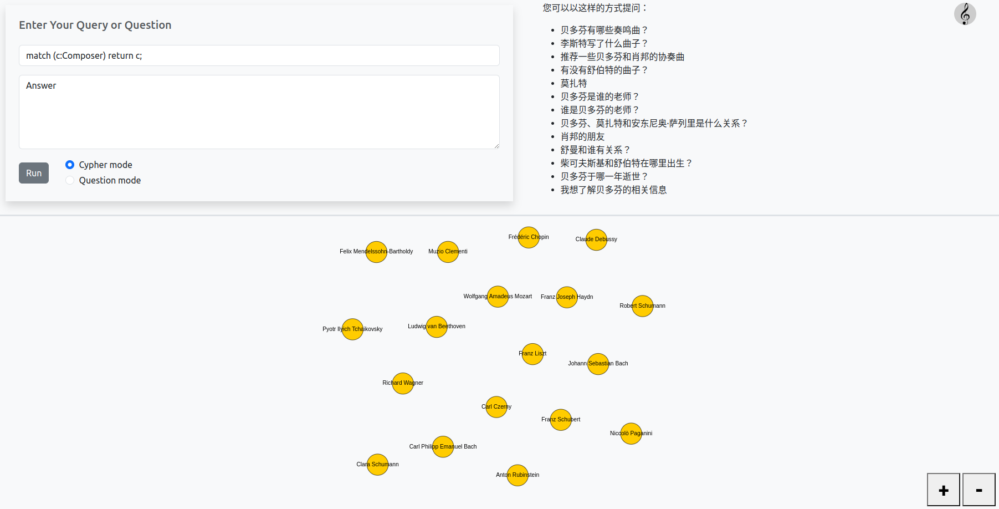
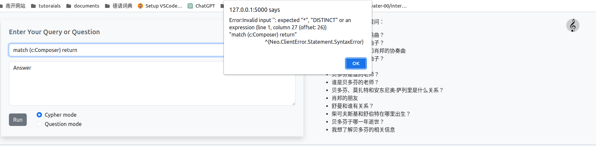
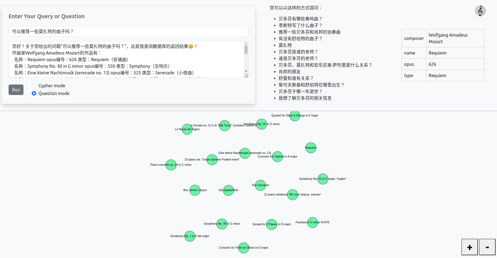
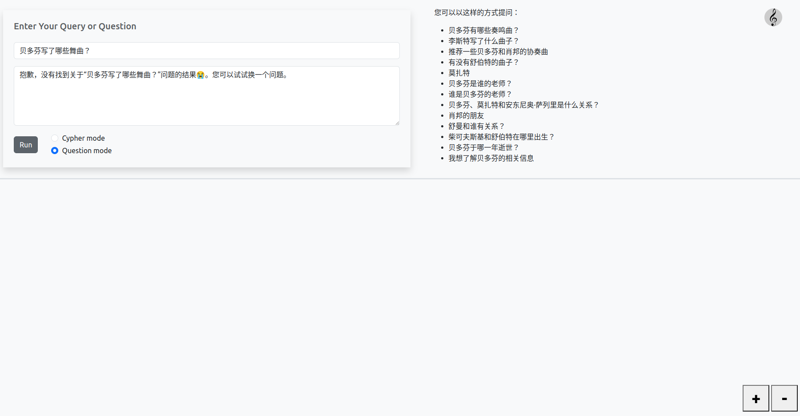
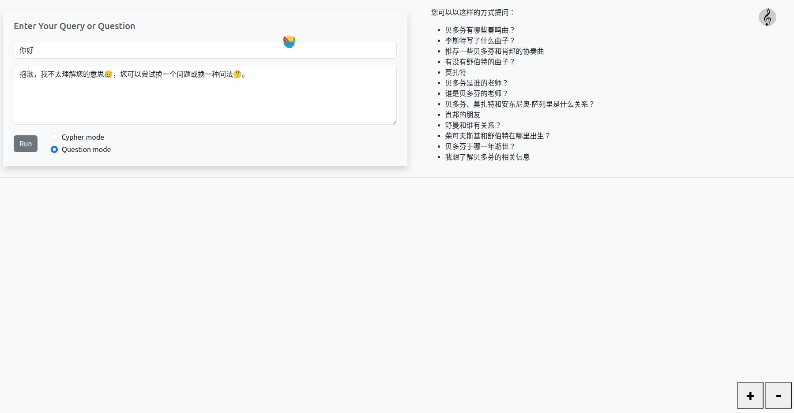
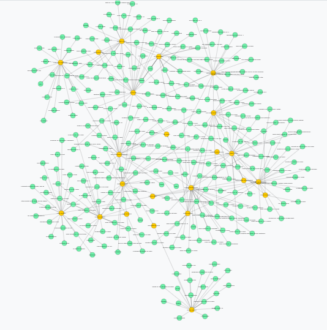

# 项目需求说明书

## 一、项目背景

### 1、背景

​		知识图谱是一种以图形结构组织、表示和存储知识的方式。它使用实体、属性和关系来描述现实世界中的事物，并形成一个结构化、语义丰富的知识网络。知识图谱在互联网搜索、智能推荐、自然语言处理等领域有广泛应用，帮助人们更好地理解知识之间的联系和上下文，成为推动信息处理和人工智能发展的关键技术之一。

### 2、目的

​		通过Neo4j知识图谱技术的运用，创造一个智能、便捷且的问答系统，帮助用户高效获取古典音乐的相关信息，解决日常生活和工作中的问题。

### 3、意义

​		古典音乐知识图谱问答系统能够极大地丰富用户对古典音乐的了解，发现不同时期和风格的古典音乐作品，了解作曲家的生平等。

## 二、功能说明

### 1、Cypher查询模式

#### 功能描述

​		在输入框中直接输入正确格式的Cypher查询语句，系统执行该语句并返回结果。

#### 演示示例

​		输入格式正确，查询成功：

		输入格式不正确，提示：



### 2、问答模式

#### 功能描述

​		用户还可以在输入框中输入想要查询的问题，由系统识别该问题并转化成查询语句执行后再输出结果。

​		**问题示例：**

+ 贝多芬有哪些奏鸣曲？
+ 可以推荐一些莫扎特的曲子吗？
+ 贝多芬、利奥波德·莫扎特和安东尼奥·萨列里这三个人是什么关系？
+ 柴可夫斯基和舒伯特是在哪里出生的？
+ 贝多芬的老师是谁？

​		如果系统查询到了相应的结果则输出答案，如果没有查询到响应结果或者输入的问题不合法则输出相应的提示。

#### 演示示例

​		正确输出回答：

		没有查询到对应结果：



​		输入问题不合法：



### 3、输出结果可视化

#### 功能描述

​		通过D3.js库实现了一个简单的力导向图布局，将从Neo4j查询结果中获取的节点和关系数据在canvas画布上绘制成可视化的图谱。同时将图谱中不同类型的节点标签映射到不同的颜色，以区分不同类型的节点。

#### 演示示例



## 三、实现方式

### 1、数据库设计

#### 数据库结构

##### 实体

+ **乐曲类实体**：Piece(id, composer, name, opus, type)
+ **作曲家类实体**：Composer(id, birth_day, birth_place, death_day, name)
+ **非作曲家人物类实体**：Person(id, name)

##### 关系

+ **人物之间的关系**：父亲、好友、老师、出版社、女婿、合伙人、夫妻、暗恋、至交、雇主
+ **人物与作品的关系**：创作

### 2、数据获取

​		通过网络爬虫获取了网站https://www.classiccat.net/中的数据。文件**get_music_info.py**主要使用了selenium库和xpath方法动态爬取了图谱中涉及到的作曲家的前20首热门曲目的相关信息和作曲家信息，并保存到csv中。

### 3、前端网页的搭建

​		网页前端主要包括`index.html`和`index.js`两个文件，以及一些背景音乐和图标素材。在`index.html`中主要是用CSS框架实现页面布局，并引入第三方Javascript库D3.js用于绘制力导向（force directed）图。

​		在`index.js`中实现了提交请求后用于查询的具体函数`submitQuery()`，它的逻辑如下：先判断当前是`cypher mode`还是`question mode`，如果是前者则直接调用`executeCypherQuery(inputString)`，它会执行：向neo4j server发送查询请求、根据server的返回情况决定绘制力导向图或输出错误信息；如果是后者则向`chatbot.py`发送问题，`chatbot.py`会返回回答和得到回答的cypher语句，`submitQuery()`接下来根据得到的cypher执行`executeCypherQuery(cypherString)`，在文本框中输出文字答案的同时绘制力导向图。

​		另外`index.js`中还有使用`D3.js`库画力导向图的`updateGraph(nodes, links)`函数，但这一部分基本按照官方文档写即可，故此处不再赘述。

### 4、chatbot的设计与实现

#### 概述

​		chatbot.py是项目后端的一个模块，它的主要功能为将输入的问题字符串转化为对应的Cypher查询语句并根据查询结果和问题类型输出对应的回答语句，要实现chatbot的功能，可将其分为三大部分依次实现，分别为：

+ 问题分类模块：负责提取输入问题中的关键字并判断问题的类型
+ 查询语句生成模块：负责接收问题分类模块传入的对应数据并生成查询语句
+ 回答语句生成模块：负责将生成的查询语句送入数据库中执行，并根据返回结果和问题类型生成对应的回答语句。

​		下面将依次说明三个模块的具体实现方式。

#### 问题分类模块

##### 数据准备工作

​		在实现具体的分类前，首先需要准备一些必要的数据，这些数据主要用于提取问题关键字以对问题进行分类，以及名词的中英文翻译对照，具体来说分为以下几类：

+ 实体和特征词列表：问题中可能出现的实体列表，例如中英文的人名、人物关系、作品名称、作品种类
+ 中英文对照词典：由于数据库中的实体名称使用英文，而一般用户输入的是中文名称，因此需要词典以实现中英文的转化
+ 问句疑问词表：问句中包含的一些词语能够反映问题的类型，例如：“和谁”反映出这一问题很大概率提问的是人物关系。通过提取这些词语，可以便于实现问题的分类。

​		这些数据的收集一般通过读取文件以及手动添加实现。

##### 特征词提取

​		在收集完所有的特征词后，将所有的特征词进行分类，通过构造领域actree，提高检索效率。针对输入的问题，提取其中包含的特征词及其对应的类别。所有准备工作完成后，进入最终的问题分类。

##### 问题分类

​		跟据提取到的特征词的种类，对问题进行分类，结合数据库本身的结构，可以将问题大致分为以下几类：

+ 作品列举类：列举一个或多个作曲家的全部或特定种类作品
+ 人物关系类：列举一个或多个人物之间的全部或特定关系
+ 人物信息类：查询一个或多个人物的全部信息或部分信息
+ 未知类型：没有提取到问题中的关键词或关键词没有匹配到对应的类型

​		每一个大类又可以细分成其他子类的问题，因此基本涵盖了所有可能的用户需求。最终问题分类模块将问题中包含的实体、实体类型和问题类型全部打包发送给查询语句生成模块。

#### 查询语句生成模块

​		在接收到问题类型和实体列表后，该模块针对不同种类的问题分开进行处理，生成对应的查询语句。其中涉及多个人或种类的查询语句通过获得实体列表中的人物或种类列表，以特定的Cypher查询格式输出。

​		**示例**：查询若干作曲家的若干类型曲目

```python
c = "MATCH (m:Piece) where m.composer in {0} and m.type in {1} return m".format(composers, types)
```

​		此外还需要注意注意实体与疑问词之间的位置关系，例如：“贝多芬的老师是谁？”和“谁是贝多芬的老师？”虽然实体列表相同，问题的含义却不同，在代码中也对这类问题进行了特殊的处理。

​		查询语句生成后，将语句与问题类型传入最终的回答语句生成模块。

#### 回答语句生成模块

​		该模块将查询语句在数据库中执行，并接收返回结果，对结果进行分类和提取，最终针对不同的问题类型，生成不同的回答语句格式。在回答中，为了体现chatbot的友善性和亲和性，加入了一些生动的emoji表情😊。

​		以上是chatbot的全部功能，接下来需要将它和前端代码进行连接，使得其生成的查询语句能够执行并在前端图中显示，生成的回答语句能够在对话框中显示。

### 5、前后端的连接

主要是使用`fetch`函数和`JSON`格式完成前后端的传递，可以直接看代码：

```javascript
// 创建POST请求
let response = fetch(neo4j_http_url, {
    method: 'POST',
    headers: {
        "Authorization": "Basic " + btoa(`${neo4jUsername}:${neo4jPassword}`),
        "Content-Type": "application/json",
        "Accept": "application/json;charset=UTF-8",
    },

    // https://neo4j.com/docs/http-api/current/actions/query-format/
    body: '{"statements":[{"statement":"' + inputString.replace(/(\r\n|\n|\r)/gm, "\\n").replace(/"/g, '\\"') + '", "resultDataContents":["graph", "row"]}]}'
})
.then(res => res.json())
.then(data => {
    // 如果cypher查询没有查到，输出错误信息
    if (data.errors != null && data.errors.length > 0 && inputString.length > 0) {
        alert(`Error:${data.errors[0].message}(${data.errors[0].code})`);
        return;
    }

    // 如果cypher查询找到了，则绘制图
    if (data.results != null && data.results.length > 0 && data.results[0].data != null && data.results[0].data.length > 0) {
        // 省略绘制图的准备内容...
    }

    // 将formatted lists of nodes and links丢给绘制函数
    updateGraph(Object.values(nodeItemMap), Object.values(linkItemMap));
});

```

总的来看，就是用`fetch`函数，根据url创建请求头，并把请求内容包装成JSON格式，然后解析请求结果，根据结果进行不同的后续内容。
