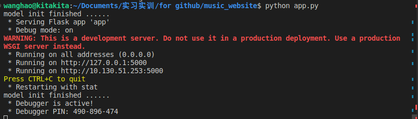

需要先运行`../music_project/neo4j_project.py`（记得修改密码）：

```
python neo4j_project.py
```

登陆`http://localhost:7474/browser/`检查是否正确得到了图数据库

然后修改`index.js`中的密码，修改好后直接拖动`index.html`到浏览器中（`./app.py`还没写好），应该就能正常访问

需要访问website，先

```
pip install flask
pip install flask_cors
```

然后修改`app.py`中的密码（可以用搜索"wang250188"找到密码所在位置），然后

```
python app.py
```



`Ctrl+Click http://127.0.0.1:5000`这个域名即可

在`app.py`中搜索TODO找到要解决的问题
