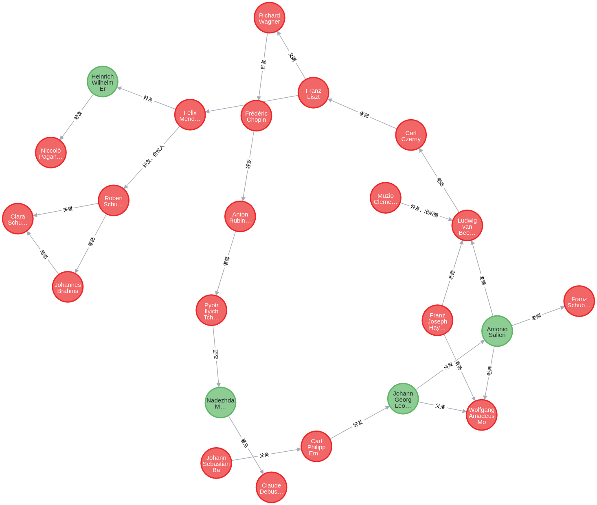
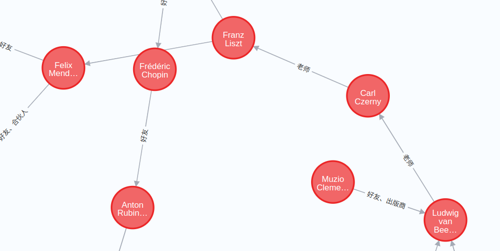
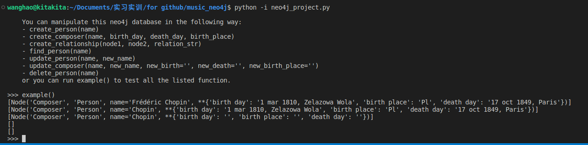

<<<<<<< HEAD
# music_mysql说明文档

# 基础部分

## 系统简介

⼀个简单的个⼈⾳乐收藏数据库，有查询⾳乐、查询作曲家、添加⾳乐、删除⾳乐等功能。

## 功能描述（CRUD）

### 1.删除操作

给两个参数str1和str2（其中⼀个可以为空），如果数据库中有该参数的模糊匹配，则找到对应曲⼦

**表连接涉及字段**：where opus like '%" + str1 + "%' and composer like '%" + str2 + "%

**代码：**

```mysql
def delete_piece():# 删除曲子界面
    frm = Toplevel()
    frm.rowconfigure([0, 1, 2, 3, 4, 5, 6, 7], minsize=50)
    frm.columnconfigure(0, minsize=50)
    
    Label(master=frm, text='Opus:', font=('Arial', 18)).grid(row=0, column=0)
    e1 = Entry(master=frm, font=('Arial', 18), width=20)
    e1.grid(row=1, column=0)
    Label(master=frm, text='composer:', font=('Arial', 18)).grid(row=2, column=0)
    e2 = Entry(master=frm, font=('Arial', 18), width=20)
    e2.grid(row=3, column=0)
    
    click = lambda:exec_delete_piece(frm, e1.get(), e2.get())
    Button(master=frm, text='search', command=click).grid(row=4, column=0)


def exec_delete_piece(frm, opus, composer):# 删除曲子
    tree = ttk.Treeview(master=frm)
    ls = ['Opus', 'name', 'composer', 'album']
    tree['columns'] = ('Opus', 'name', 'composer', 'album')
    for i in ls:
        tree.column(i, anchor='center')
        tree.heading(i, text=i)
        
    show_sql = "select * from piece where opus like '%" + opus + "%' and composer like '%" + composer + "%';"
    cursor.execute(show_sql)
    result = cursor.fetchall()
    for i in range(len(result)):
        tree.insert("", i, values=result[i])
    tree['show'] = 'headings'
    tree.grid(row=7, column=0)
    
    del_sql = "delete from piece where opus like '%" + opus + "%' and composer like '%" + composer + "%';"
    click = lambda:confirm(frm, del_sql)
    Button(frm, text='delete all', command=click).grid(row=5, column=0)
    click = lambda:cancel(frm, del_sql)
    Button(frm, text='cancel', command=click).grid(row=6, column=0)
    
def confirm(frm, del_sql):# 确认执行commit
    cursor.execute("START TRANSACTION")
    cursor.execute(del_sql)
    cursor.execute("COMMIT")
    messagebox.showinfo(message='Delete successfully.')
    
def cancel(frm, del_sql):# 取消执行rollback
    cursor.execute("START TRANSACTION")
    cursor.execute(del_sql)
    cursor.execute("ROLLBACK")
    messagebox.showinfo(message='Deletion canceled.')
```


### 2.添加操作

添加曲⼦，如果piece.composer不在composer表中，则执⾏触发器

**触发器描述**：如果piece.composer不在composer表中，则执⾏触发器

**插⼊操作源码：**

```mysql
def add_piece():# 添加曲子界面
    frm = Toplevel()
    frm.rowconfigure([0, 1, 2, 3, 4, 5, 6, 7, 8, 9], minsize=50)
    frm.columnconfigure(0, minsize=50)
    
    Label(master=frm, text='Opus:', font=('Arial', 18)).grid(row=0, column=0)
    e1 = Entry(master=frm, font=('Arial', 18), width=20)
    e1.grid(row=1, column=0)
    Label(master=frm, text='name:', font=('Arial', 18)).grid(row=2, column=0)
    e2 = Entry(master=frm, font=('Arial', 18), width=20)
    e2.grid(row=3, column=0)
    Label(master=frm, text='composer:', font=('Arial', 18)).grid(row=4, column=0)
    e3 = Entry(master=frm, font=('Arial', 18), width=20)
    e3.grid(row=5, column=0)
    Label(master=frm, text='album:', font=('Arial', 18)).grid(row=6, column=0)
    e4 = Entry(master=frm, font=('Arial', 18), width=20)
    e4.grid(row=7, column=0)
    
    
    click = lambda:exec_add_piece(frm, e1.get(), e2.get(), e3.get(), e4.get())
    Button(master=frm, text='add', command=click).grid(row=8, column=0)


def exec_add_piece(frm, opus, name, composer, album):# 添加曲子
    sql = "insert into piece values('" + opus + "', '" + name + "', '" + composer + "', '" + album + "');"
    try:
        cursor.execute(sql)
        messagebox.showinfo(message="Successful!")
    except Exception as m:
        messagebox.showerror("error", m.args)
```

**触发器源码:**

`DELIMITER ;; !50003 CREATE DEFINER=`root`@`localhost`RIGGER `check_insert_piece` BEFORE INSERT ON `piece` FOR EACH ROW begin if new.composer not in (select name from composer) then signal SQLSTATE '45000' set message_text = "composer not exsits."; end if; end */;; DELIMITER ;`


### 3.更新操作

更改piece中某⾸曲⼦的所属专辑。⽤procedure更改piece.album，要求新的piece.album在album表中。

**表连接涉及字段**：album_name not in (select name from album)

**更新代码：**

```mysql
def exec_search_piece(frm, str1, str2):# 曲子查找结果展示以及更新专辑
    tree = ttk.Treeview(master=frm)
    ls = ['Opus', 'name', 'composer', 'album', 'country']
    tree['columns'] = ('Opus', 'name', 'composer', 'album', 'country')
    for i in ls:
        tree.column(i, anchor='center')
        tree.heading(i, text=i)
    sql = "select * from info "
    if str1 != '' and str2 != '':
        sql = sql + "where opus like '%" + str1 + "%' and name like '%" + str2 + "%';"
    elif str1 != '':
        sql = sql + "where opus like '%" + str1 + "%';"
    elif str2 != '':
        sql = sql + "where name like '%" + str2 + "%';"
    else:
        Label(master=frm, text='input valid', font=('Arial', 18)).grid(row=5, column=0)
        return
    cursor.execute(sql)
    result = cursor.fetchall()
    for i in range(len(result)):
        tree.insert('', i, values=result[i])
    tree['show'] = 'headings'
    tree.grid(row=5, column=0)

    # update album
    if (len(result) == 1 and str1 != ''):
        Label(master=frm, text='new album:', font=('Arial', 18)).grid(row=6, column=0)
        e3 = Entry(master=frm, font=('Arial', 18), width=20)
        e3.grid(row=7, column=0)
        click = lambda:exec_update(frm, str1, e3.get())
        Button(master=frm, text="update", command=click).grid(row=8, column=0)
```

**创建存储过程源码：**

```mysql
create procedure update_album(in opus_name varchar(20), in album_name varchar(50))
begin
    if album_name not in (select name from album) then
        signal sqlstate '45000'
        set message_text = 'album not exists.';
    else
        update piece set album = album_name where Opus like CONCAT('%', opus_name, '%');
    end if;
end;
```

**存储过程执⾏源码：**

```mysql
def exec_update(frm, opus, new_album):# 更新专辑信息
    sql = "call update_album('" + opus + "', '" + new_album + "');"
    try:
        cursor.execute(sql)
        messagebox.showinfo(message='update successfully.')
    except Exception as m:
        messagebox.showerror('error', m.args)
```


### 4.查询操作

根据opus, name模糊匹配找到⼀⾸曲⼦。

**表连接字段**：where opus like '%" + str1 + "%' and name like '%" + str2 + "%'

**查询代码：**

```mysql
def search_piece():# 曲子查找界面
    frm = Toplevel()
    frm.rowconfigure([0, 1, 2, 3, 4, 5, 6, 7, 8, 9, 10], minsize=50)
    frm.columnconfigure(0, minsize=50)
    Label(master=frm, text='Opus:', font=('Arial', 18)).grid(row=0, column=0)
    e1 = Entry(master=frm, font=('Arial', 18), width=20)
    e1.grid(row=1, column=0)
    Label(master=frm, text='name:', font=('Arial', 18)).grid(row=2, column=0)
    e2 = Entry(master=frm, font=('Arial', 18), width=20)# e1、e2输入
    e2.grid(row=3, column=0)
    click = lambda:exec_search_piece(frm, e1.get(), e2.get())
    Button(master=frm, text='search', command=click).grid(row=4, column=0)


def exec_search_piece(frm, str1, str2):# 曲子查找结果展示以及更新专辑
    tree = ttk.Treeview(master=frm)
    ls = ['Opus', 'name', 'composer', 'album', 'country']
    tree['columns'] = ('Opus', 'name', 'composer', 'album', 'country')
    for i in ls:
        tree.column(i, anchor='center')
        tree.heading(i, text=i)
    sql = "select * from info "
    if str1 != '' and str2 != '':
        sql = sql + "where opus like '%" + str1 + "%' and name like '%" + str2 + "%';"
    elif str1 != '':
        sql = sql + "where opus like '%" + str1 + "%';"
    elif str2 != '':
        sql = sql + "where name like '%" + str2 + "%';"
    else:
        Label(master=frm, text='input valid', font=('Arial', 18)).grid(row=5, column=0)
        return
    cursor.execute(sql)
    result = cursor.fetchall()
    for i in range(len(result)):
        tree.insert('', i, values=result[i])
    tree['show'] = 'headings'
    tree.grid(row=5, column=0)

    # update album
    if (len(result) == 1 and str1 != ''):
        Label(master=frm, text='new album:', font=('Arial', 18)).grid(row=6, column=0)
        e3 = Entry(master=frm, font=('Arial', 18), width=20)
        e3.grid(row=7, column=0)
        click = lambda:exec_update(frm, str1, e3.get())
        Button(master=frm, text="update", command=click).grid(row=8, column=0)
```


## 拓展部分

### 1.数据来源

通过[网络爬虫](https://www.classiccat.net/)，得到真实大量的古典音乐信息。

如每首曲子的rank,name,opus,versions,duration,composer_name,composer_life等信息。

再通过数据处理，如分词等操作，得到我们需要的与关系型数据库匹配的数据。

在关系型数据库中，我们创建了piece和composer两种表，有爬虫的到的信息进行切割，得到相对应的数据。


### 2.可视化程序

使用python的tkinter可视化工具，实现了乐曲查询程序的可视化，同时通过Pyinstaller库将程序打包封装为exe可执行文件以方便移植。


### 3.多表查询

通过多表查询，将piece与composer连接，获取一首乐曲的全部信息。

**查询语句**：select opus opus, piece.name name, piece.composer composer, piece.album album, composer.birthplace birthplace from piece, composer where piece.composer = composer.name;

### 4.完善功能

新增加了添加专辑、添加作曲家信息的界面与功能。


# music_neo4j说明文档

设计了一个包含许多作曲家关系的图形化数据库：



其中红色的表示有作品的作曲家，绿色的表示没有作品但是也与作曲家有联系的普通人。放大来看：



并且也实现了CRUD功能，这里采用比较简单的在`python -i`交互模式下的测试，没有像数据库一样写一个gui：



其中`example()`的代码为：

```python
def example():
    # update & read
    print(find_person("chopin"))
    update_person('chopin', 'Chopin') # give Chopin a shorter name
    print(find_person("chopin"))
    update_composer('chopin', 'Chopin') # replace all informations of Chopin as ''
    print(find_person("chopin"))

    # create
    A = create_composer("Composer A", '', '', '')
    B = create_person("Person B")
    chopin = find_person("chopin")[0]
    create_relationship(A, chopin, 'friend')
    create_relationship(B, chopin, 'friend')

    # delete
    a = A['name']; b = B['name']
    delete_person(a)
    delete_person(b)
    print(find_person(a)) # delete successfully
    print(find_person(b))
```

测试了CRUD的全部函数，并且每一步在neo4j server上也有正确体现。
=======
# music_mysql说明文档
拓展部分没有单列一个exfunc文件夹，而是把内容也放在了music_mysql下，可以看本文档对应的内容

# 基础部分

## 系统简介

⼀个简单的个⼈⾳乐收藏数据库，有查询⾳乐、查询作曲家、添加⾳乐、删除⾳乐等功能。

## 功能描述（CRUD）

### 1.删除操作

给两个参数str1和str2（其中⼀个可以为空），如果数据库中有该参数的模糊匹配，则找到对应曲⼦

**表连接涉及字段**：where opus like '%" + str1 + "%' and composer like '%" + str2 + "%

**代码：**

```mysql
def delete_piece():# 删除曲子界面
    frm = Toplevel()
    frm.rowconfigure([0, 1, 2, 3, 4, 5, 6, 7], minsize=50)
    frm.columnconfigure(0, minsize=50)
    
    Label(master=frm, text='Opus:', font=('Arial', 18)).grid(row=0, column=0)
    e1 = Entry(master=frm, font=('Arial', 18), width=20)
    e1.grid(row=1, column=0)
    Label(master=frm, text='composer:', font=('Arial', 18)).grid(row=2, column=0)
    e2 = Entry(master=frm, font=('Arial', 18), width=20)
    e2.grid(row=3, column=0)
    
    click = lambda:exec_delete_piece(frm, e1.get(), e2.get())
    Button(master=frm, text='search', command=click).grid(row=4, column=0)


def exec_delete_piece(frm, opus, composer):# 删除曲子
    tree = ttk.Treeview(master=frm)
    ls = ['Opus', 'name', 'composer', 'album']
    tree['columns'] = ('Opus', 'name', 'composer', 'album')
    for i in ls:
        tree.column(i, anchor='center')
        tree.heading(i, text=i)
        
    show_sql = "select * from piece where opus like '%" + opus + "%' and composer like '%" + composer + "%';"
    cursor.execute(show_sql)
    result = cursor.fetchall()
    for i in range(len(result)):
        tree.insert("", i, values=result[i])
    tree['show'] = 'headings'
    tree.grid(row=7, column=0)
    
    del_sql = "delete from piece where opus like '%" + opus + "%' and composer like '%" + composer + "%';"
    click = lambda:confirm(frm, del_sql)
    Button(frm, text='delete all', command=click).grid(row=5, column=0)
    click = lambda:cancel(frm, del_sql)
    Button(frm, text='cancel', command=click).grid(row=6, column=0)
    
def confirm(frm, del_sql):# 确认执行commit
    cursor.execute("START TRANSACTION")
    cursor.execute(del_sql)
    cursor.execute("COMMIT")
    messagebox.showinfo(message='Delete successfully.')
    
def cancel(frm, del_sql):# 取消执行rollback
    cursor.execute("START TRANSACTION")
    cursor.execute(del_sql)
    cursor.execute("ROLLBACK")
    messagebox.showinfo(message='Deletion canceled.')
```


### 2.添加操作

添加曲⼦，如果piece.composer不在composer表中，则执⾏触发器

**触发器描述**：如果piece.composer不在composer表中，则执⾏触发器

**插⼊操作源码：**

```mysql
def add_piece():# 添加曲子界面
    frm = Toplevel()
    frm.rowconfigure([0, 1, 2, 3, 4, 5, 6, 7, 8, 9], minsize=50)
    frm.columnconfigure(0, minsize=50)
    
    Label(master=frm, text='Opus:', font=('Arial', 18)).grid(row=0, column=0)
    e1 = Entry(master=frm, font=('Arial', 18), width=20)
    e1.grid(row=1, column=0)
    Label(master=frm, text='name:', font=('Arial', 18)).grid(row=2, column=0)
    e2 = Entry(master=frm, font=('Arial', 18), width=20)
    e2.grid(row=3, column=0)
    Label(master=frm, text='composer:', font=('Arial', 18)).grid(row=4, column=0)
    e3 = Entry(master=frm, font=('Arial', 18), width=20)
    e3.grid(row=5, column=0)
    Label(master=frm, text='album:', font=('Arial', 18)).grid(row=6, column=0)
    e4 = Entry(master=frm, font=('Arial', 18), width=20)
    e4.grid(row=7, column=0)
    
    
    click = lambda:exec_add_piece(frm, e1.get(), e2.get(), e3.get(), e4.get())
    Button(master=frm, text='add', command=click).grid(row=8, column=0)


def exec_add_piece(frm, opus, name, composer, album):# 添加曲子
    sql = "insert into piece values('" + opus + "', '" + name + "', '" + composer + "', '" + album + "');"
    try:
        cursor.execute(sql)
        messagebox.showinfo(message="Successful!")
    except Exception as m:
        messagebox.showerror("error", m.args)
```

**触发器源码:**

`DELIMITER ;; !50003 CREATE DEFINER=`root`@`localhost`RIGGER `check_insert_piece` BEFORE INSERT ON `piece` FOR EACH ROW begin if new.composer not in (select name from composer) then signal SQLSTATE '45000' set message_text = "composer not exsits."; end if; end */;; DELIMITER ;`


### 3.更新操作

更改piece中某⾸曲⼦的所属专辑。⽤procedure更改piece.album，要求新的piece.album在album表中。

**表连接涉及字段**：album_name not in (select name from album)

**更新代码：**

```mysql
def exec_search_piece(frm, str1, str2):# 曲子查找结果展示以及更新专辑
    tree = ttk.Treeview(master=frm)
    ls = ['Opus', 'name', 'composer', 'album', 'country']
    tree['columns'] = ('Opus', 'name', 'composer', 'album', 'country')
    for i in ls:
        tree.column(i, anchor='center')
        tree.heading(i, text=i)
    sql = "select * from info "
    if str1 != '' and str2 != '':
        sql = sql + "where opus like '%" + str1 + "%' and name like '%" + str2 + "%';"
    elif str1 != '':
        sql = sql + "where opus like '%" + str1 + "%';"
    elif str2 != '':
        sql = sql + "where name like '%" + str2 + "%';"
    else:
        Label(master=frm, text='input valid', font=('Arial', 18)).grid(row=5, column=0)
        return
    cursor.execute(sql)
    result = cursor.fetchall()
    for i in range(len(result)):
        tree.insert('', i, values=result[i])
    tree['show'] = 'headings'
    tree.grid(row=5, column=0)

    # update album
    if (len(result) == 1 and str1 != ''):
        Label(master=frm, text='new album:', font=('Arial', 18)).grid(row=6, column=0)
        e3 = Entry(master=frm, font=('Arial', 18), width=20)
        e3.grid(row=7, column=0)
        click = lambda:exec_update(frm, str1, e3.get())
        Button(master=frm, text="update", command=click).grid(row=8, column=0)
```

**创建存储过程源码：**

```mysql
create procedure update_album(in opus_name varchar(20), in album_name varchar(50))
begin
    if album_name not in (select name from album) then
        signal sqlstate '45000'
        set message_text = 'album not exists.';
    else
        update piece set album = album_name where Opus like CONCAT('%', opus_name, '%');
    end if;
end;
```

**存储过程执⾏源码：**

```mysql
def exec_update(frm, opus, new_album):# 更新专辑信息
    sql = "call update_album('" + opus + "', '" + new_album + "');"
    try:
        cursor.execute(sql)
        messagebox.showinfo(message='update successfully.')
    except Exception as m:
        messagebox.showerror('error', m.args)
```


### 4.查询操作

根据opus, name模糊匹配找到⼀⾸曲⼦。

**表连接字段**：where opus like '%" + str1 + "%' and name like '%" + str2 + "%'

**查询代码：**

```mysql
def search_piece():# 曲子查找界面
    frm = Toplevel()
    frm.rowconfigure([0, 1, 2, 3, 4, 5, 6, 7, 8, 9, 10], minsize=50)
    frm.columnconfigure(0, minsize=50)
    Label(master=frm, text='Opus:', font=('Arial', 18)).grid(row=0, column=0)
    e1 = Entry(master=frm, font=('Arial', 18), width=20)
    e1.grid(row=1, column=0)
    Label(master=frm, text='name:', font=('Arial', 18)).grid(row=2, column=0)
    e2 = Entry(master=frm, font=('Arial', 18), width=20)# e1、e2输入
    e2.grid(row=3, column=0)
    click = lambda:exec_search_piece(frm, e1.get(), e2.get())
    Button(master=frm, text='search', command=click).grid(row=4, column=0)


def exec_search_piece(frm, str1, str2):# 曲子查找结果展示以及更新专辑
    tree = ttk.Treeview(master=frm)
    ls = ['Opus', 'name', 'composer', 'album', 'country']
    tree['columns'] = ('Opus', 'name', 'composer', 'album', 'country')
    for i in ls:
        tree.column(i, anchor='center')
        tree.heading(i, text=i)
    sql = "select * from info "
    if str1 != '' and str2 != '':
        sql = sql + "where opus like '%" + str1 + "%' and name like '%" + str2 + "%';"
    elif str1 != '':
        sql = sql + "where opus like '%" + str1 + "%';"
    elif str2 != '':
        sql = sql + "where name like '%" + str2 + "%';"
    else:
        Label(master=frm, text='input valid', font=('Arial', 18)).grid(row=5, column=0)
        return
    cursor.execute(sql)
    result = cursor.fetchall()
    for i in range(len(result)):
        tree.insert('', i, values=result[i])
    tree['show'] = 'headings'
    tree.grid(row=5, column=0)

    # update album
    if (len(result) == 1 and str1 != ''):
        Label(master=frm, text='new album:', font=('Arial', 18)).grid(row=6, column=0)
        e3 = Entry(master=frm, font=('Arial', 18), width=20)
        e3.grid(row=7, column=0)
        click = lambda:exec_update(frm, str1, e3.get())
        Button(master=frm, text="update", command=click).grid(row=8, column=0)
```


## 拓展部分

### 1.数据来源

通过[网络爬虫](https://www.classiccat.net/)，得到真实大量的古典音乐信息。

如每首曲子的rank,name,opus,versions,duration,composer_name,composer_life等信息。

再通过数据处理，如分词等操作，得到我们需要的与关系型数据库匹配的数据。

在关系型数据库中，我们创建了piece和composer两种表，有爬虫的到的信息进行切割，得到相对应的数据。


### 2.可视化程序

使用python的tkinter可视化工具，实现了乐曲查询程序的可视化，同时通过Pyinstaller库将程序打包封装为exe可执行文件以方便移植。


### 3.多表查询

通过多表查询，将piece与composer连接，获取一首乐曲的全部信息。

**查询语句**：select opus opus, piece.name name, piece.composer composer, piece.album album, composer.birthplace birthplace from piece, composer where piece.composer = composer.name;

### 4.完善功能

新增加了添加专辑、添加作曲家信息的界面与功能。


# music_neo4j说明文档

设计了一个包含许多作曲家关系的图形化数据库：


其中红色的表示有作品的作曲家，绿色的表示没有作品但是也与作曲家有联系的普通人。放大来看：


并且也实现了CRUD功能，这里采用比较简单的在`python -i`交互模式下的测试，没有像数据库一样写一个gui：


其中`example()`的代码为：

```python
def example():
    # update & read
    print(find_person("chopin"))
    update_person('chopin', 'Chopin') # give Chopin a shorter name
    print(find_person("chopin"))
    update_composer('chopin', 'Chopin') # replace all informations of Chopin as ''
    print(find_person("chopin"))

    # create
    A = create_composer("Composer A", '', '', '')
    B = create_person("Person B")
    chopin = find_person("chopin")[0]
    create_relationship(A, chopin, 'friend')
    create_relationship(B, chopin, 'friend')

    # delete
    a = A['name']; b = B['name']
    delete_person(a)
    delete_person(b)
    print(find_person(a)) # delete successfully
    print(find_person(b))
```

测试了CRUD的全部函数，并且每一步在neo4j server上也有正确体现。
>>>>>>> ddff30a5193c7b5197923b1b8a4f925c78d37ab9
